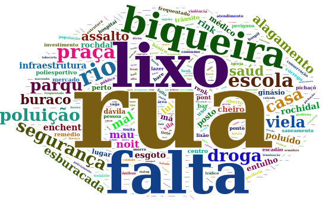

[^1]: Graduando no Bacharelado em Estatística e Ciência de Dados do Instituto de Ciências Matemáticas e de Computação da Universidade de São Paulo (ICMC - USP).

Este repositório contém o código em linguagem *R*, implementado com auxílio das biblitecas *shiny* e *leaflet*, de um site interativo de um mapa da cidade de Osasco - SP, com pontos de interesse elencados através de um questionário aplicado a 217 alunos da E.E. Prof. Alcyr de Oliveira Ponciúncula, na disciplina de Sociologia, aplicado pela Profa. Maria Cecília Dias da Cruz.

## Objetivo 

- Fornecimento de recursos para uma análise exploratória qualitativa dos dados,
- Ilustrar a criação de uma aplicação web para mapear diferentes pontos de interesse dos alunos.

## Análise Exploratória

Neste trabalho, recebemos um conjunto de dados com o mapeamento geográfico de pontos de interesse em Osasco (SP), classificados como **positivos** ou **negativos** pelos alunos. A Figura 1  ilustra a distribuição de alunos por classe e bairro. Deixamos apenas os 6 bairros mais mencionados.

Além disso, os **pontos positivos** escolhidos pelos alunos foram recodificados em cinco principais **categorias**, conforme ilustrado na Tabela abaixo:

| **Categoria** | **Respostas Consideradas** |
|:-:|:-:|
| Lugares para exercícios físicos, praças  e áreas verdes | Academia, praças com equipamentos para condicionamento físico, campo de futebol de várzea, ginásio, clubes com piscina, pista  de skate, árvores, borboletário, mata, parques, Pico do Jaraguá |
| Condições de  infraestrutura | Proximidade e variedade de pontos de comércio, pontos comerciais,  lanchonetes, feira, garagem de ônibus pontos de ônibus, pizzarias, shopping, sorveteria, pavimentação das ruas boas |
| Rede de acolhimento e  proteção | Igreja, respeito entre moradores, SESC Osasco |
| Características  identificadas | bairro calmo, boa localização, passear no centro,  design da igreja, grafites, vista de casa, ruas agradáveis |
| Presença de Equipamentos  Públicos | Pontos de Cultura, CEUS, ecopontos, escolas, estádios, hospitais, postos de saúde, ou teatro próximos | 
 
A Figura 2 ilustra a distribuição das respostas entre as categorias que acabamos de descrever.

## Nuvem de Palavras

A partir dos 3 pontos positivos e negativos escolhidos pelos alunos, as respostas foram agrupadas e técnicas de mineiração de texto foram utilizadas para gerar um corpus textual, pré-processar e exibir as respectivas nuvens de palavras.

Dentre as funções de pré-processamento podemos citar: remoção de palavras comuns (stop words), pontuação, números e palavras similares. Maiores detalhes sobre o *pipeline* pre-processamento utilizado pode ser encontrado no arquivo `analise_dados.R`.

As Figuras 3 e 4 ilustram as nuvens de palavras obtidas através do processo.

Para finalizar essa etapa, verificamos quais palavras possuíam mais correlação com a palavra encontrada nas respostas negativas "falta". O processo é ilustrado na Figura 5.

# Construção do mapa

Outro pré processamento nos dados realizado pela pesquisadora envolveu classificar alguns dos locais levantados pelos alunos em três principais categorias - Trabalho, Afetivo, ou Desgaste em Saude; assim como registrar a respectiva latitude e longitude de cada local.

Esse tipo de codificação nos favorece para que um certo paradigma de representação visual possa ser adotado aqui - estamos interessados em utilizar as coordenadas geográficas dos pontos para representá-los num cartograma e exibir interativamente algumas informações: nome do local, endereço e tipo de ocorrência registrada.

A aplicação encontra-se disponível em: <https://chicodias.shinyapps.io/activitymap/>.

## Implementação

#### Análise dos dados

- Importamos o questinário do arquivo `quest.xlsx` para o ambiente do R,
- Os gráficos gerados aqui estão disponíveis no arquivo `analise_dados.R`.

#### Mapa interativo

- O arquivo `dados.xlsx` contém os dados de nosso mapa,
- O arquivo `app.r` contém o código da aplicação em *shiny* responsável por gerar o site. Nele, utilizamos a biblioteca *leaflet* para renderizar o mapa e plotar os pontos de interesse.

## Licenças

Todo o conteúdo utilizado possui licença GNU GPL 3. Mais informações podem ser consultadas em <https://www.gnu.org/licenses/quick-guide-gplv3.pt-br.html>.

## Referências

- R for Data Science <https://r4ds.had.co.nz/index.html>
  
- Cookbook for R <http://www.cookbook-r.com/>

- Learn Shiny <https://shiny.rstudio.com/tutorial/#written-tutorials>

- Leaflet for R <https://rstudio.github.io/leaflet/>

- Wordcloud2 introduction <https://cran.r-project.org/web/packages/wordcloud2/vignettes/wordcloud.html>

- Transformations on Corpora <https://www.rdocumentation.org/packages/tm/versions/0.7-7/topics/tm_map>