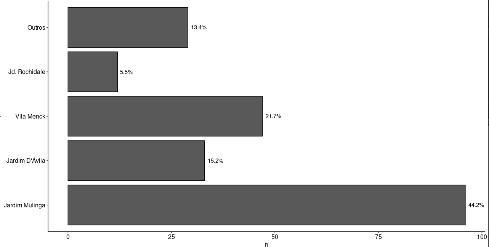

Este repositório contém o código em linguagem *R*, implementado com auxílio das biblitecas *shiny* e *leaflet*, de um site interativo de um mapa da cidade de Osasco - SP, com pontos de interesse elencados através de um questionário aplicado alunos da E.E. Prof. Alcyr de Oliveira Ponciúncula, na disciplina de Sociologia, aplicado pela Profa. Maria Cecília Dias da Cruz.

## Objetivo 

- Fornecimento de recursos para uma análise exploratória qualitativa dos dados,
- Ilustrar a criação de uma aplicação web para mapear diferentes pontos de interesse dos alunos.

## Análise Exploratória

Neste trabalho, recebemos um conjunto de dados com o mapeamento geografico de pontos de interesse em Osasco(SP), classificados como **positivos** ou **negativos** pelos alunos. As figuras 1 e 2 ilustram a distribuição de alunos por classe e bairro. Deixamos apenas 6 bairros para não poluir o gráfico.

A partir dos 3 pontos positivos e negativos escolhidos pelos alunos, utilizamos essas informações para gerar um corpus textual, pré-processar e exibir as respectivas nuvens de palavras.

# Construção do mapa

Um pré processamento inicial realizado pela pesquisadora envolveu classificar alguns desses locais em três principais categorias - Trabalho, Afetivo, ou Desgaste em Saude; assim como registrar a respectiva latitude e longitude de cada local.

Esse tipo de codificação nos favorece para que um certo paradigma de representação visual possa ser adotado aqui - estamos interessados em utilizar as coordenadas geográficas dos pontos para representá-los num cartograma e exibir interativamente algumas informações: nome do local, endereço e tipo de ocorrência registrada.

A aplicação encontra-se disponível em: <https://chicodias.shinyapps.io/activitymap/>.

## Implementação

#### Análise dos dados

- Importamos o questinário do arquivo `quest.xlsx` para o ambiente do R
- Os gráficos gerados aqui estão disponíveis no arquivo `analise_dados.R`

#### Mapa interativo

- O arquivo `dados.xlsx` contém os dados de nosso mapa
- O arquivo `app.r` contém o código da aplicação em *shiny* responsável por gerar o site. Nele, utilizamos a biblioteca *leaflet* para renderizar o mapa e plotar os pontos de interesse.

## Licenças

Todo o conteúdo utilizado possui licença em código aberto, exceto onde explicitamente mencionado.

## Referências

- Cookbook for R <http://www.cookbook-r.com/>

- Learn Shiny <https://shiny.rstudio.com/tutorial/#written-tutorials>

- Leaflet for R <https://rstudio.github.io/leaflet/>

- Wordcloud2 introduction <https://cran.r-project.org/web/packages/wordcloud2/vignettes/wordcloud.html>

